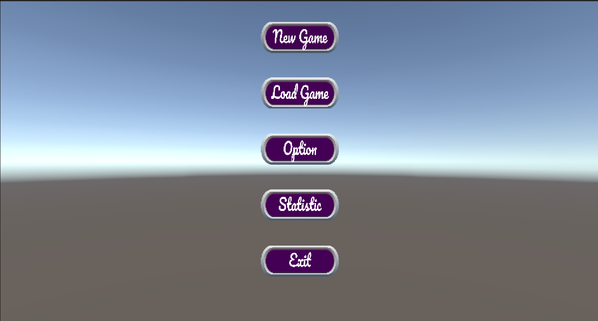
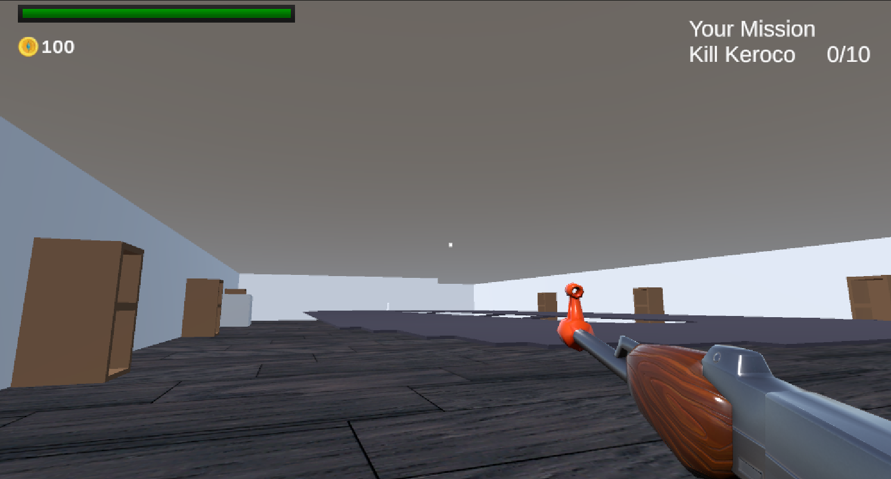
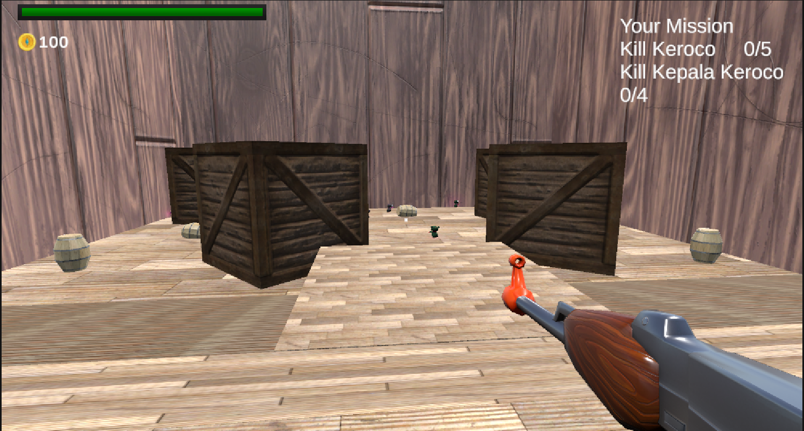
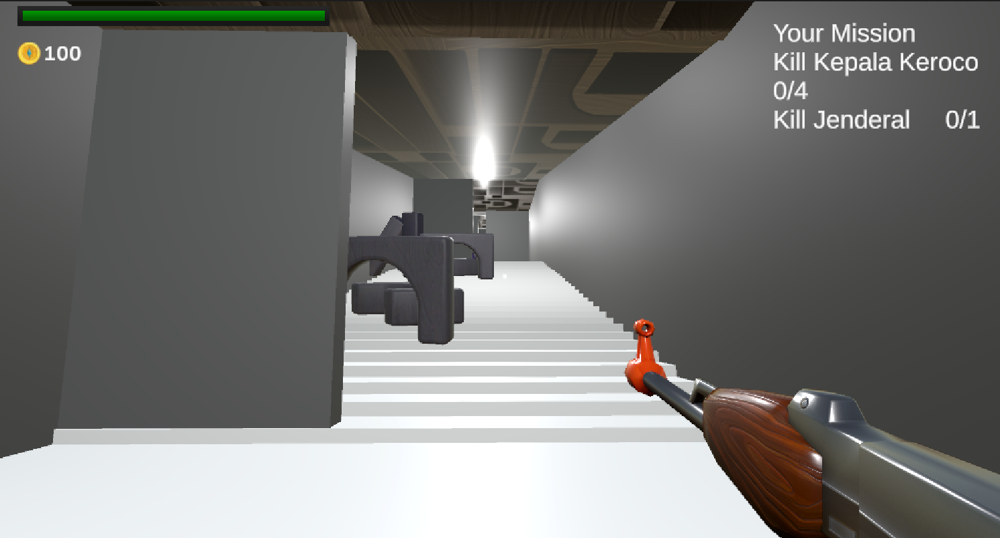
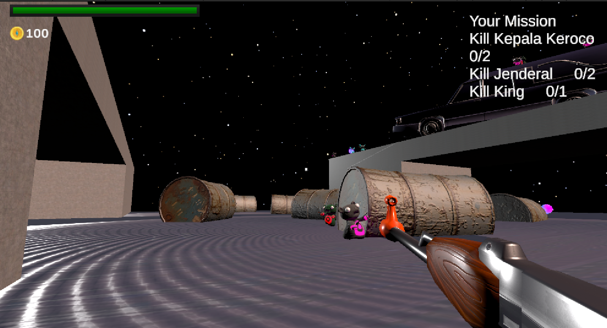
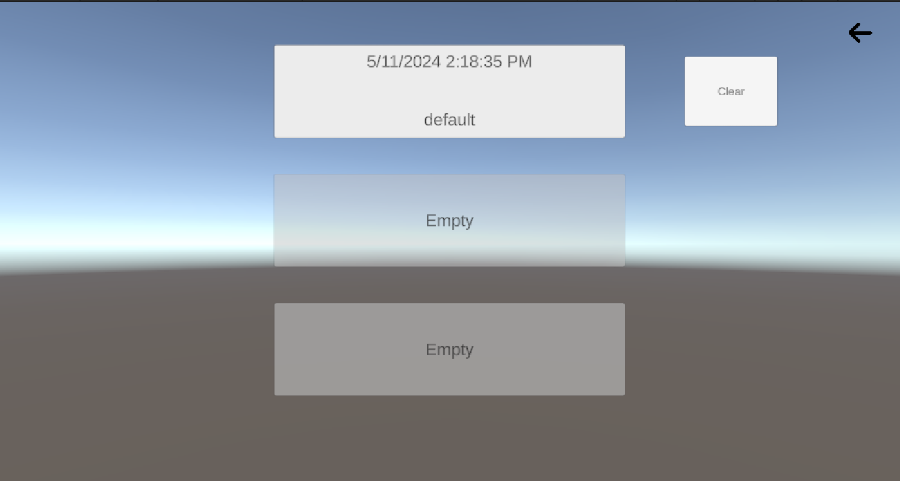
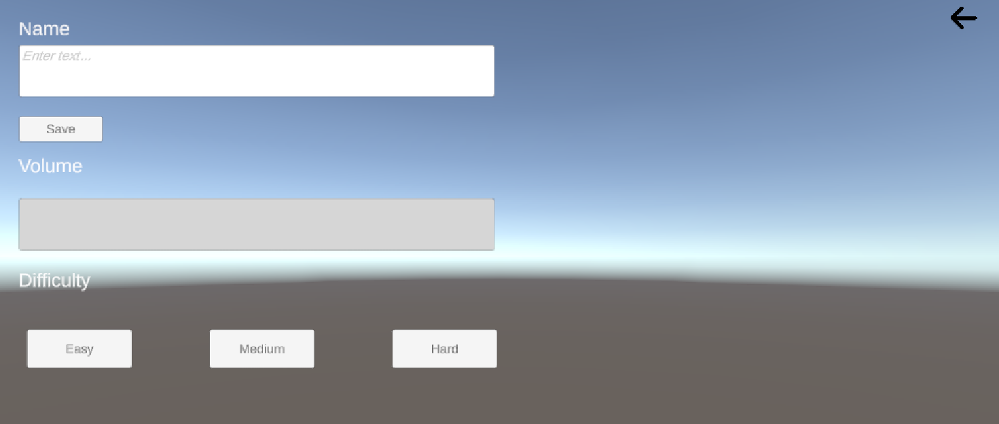
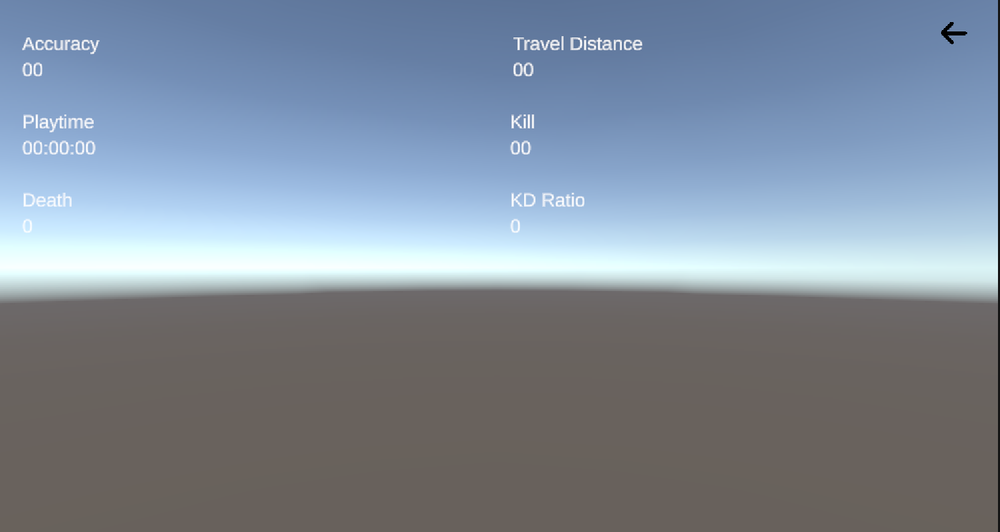
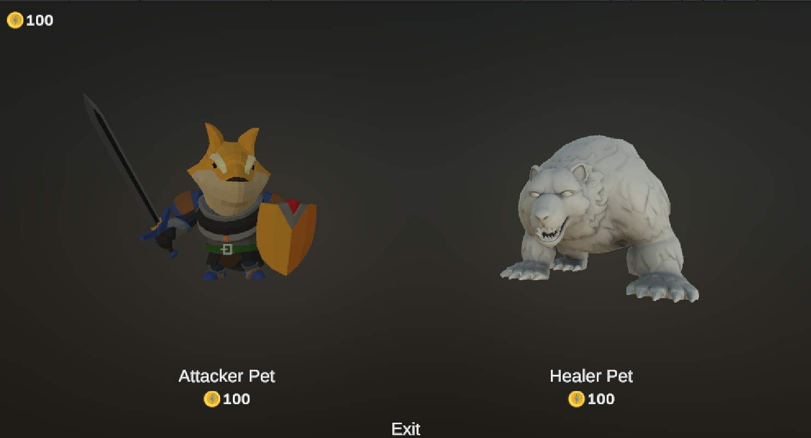

# IF3210-2024-Unity-BDM

## Deskripsi Aplikasi
Aplikasi ini adalah game bertema survival shooter
yang dikembangkan menggunakan Unity. pada game ini terdapat 4 level dan
3 cutscene. Setiap level yang telah diselesaikan akan memberikan reward 
yang bisa digunakan di shopkeeper. terdapat juga 3 cutscene yaitu 
Beginning cutscene, Death cutscene, dan Ending cutscene.

Pada Level 1 player memiliki quest untuk membunuh 10 keroco

Pada level 2 player memiliki quest untuk membunuh 5 keroco dan 4 kepala keroco

Pada level 3 player memiliki quest untuk membunuh 4 kepala keroco dan 1 jendral

Pada level 4 player memiliki quest untuk membunuh 2 kepala keroco 2 jendral dan 1 king

## Library yang digunakan

Aplikasi ini dibuat menggunakan library bawaan unity dan C#

## Screenshot aplikasi

Main menu

Level 1

Level 2

Level 3

Level 4

Save Game

Option

Statistik

Shop

## Pembagian Kerja

1. Fahrian Afdholi (13521031)

- Environment
- Game Over 
- Weapon 
- Mob
- Multitype Input

2. Ezra M C M H (13521073)

- Story
- Main Menu
- Save Game
- Statistik Game
- Game Over

3. Noel Christoffel Simbolon (13521096)

- Orb
- CutScene

4. Ammar Rasyad Chaeroel (13521136)

- Mob
- Cheat

5. Zidane Firzatullah (13521163)

- Story
- Main Menu
- Save Game
- Statistik Game
- CutScene
- ShopKeeper
- Pet
- Player
- Multitype Input

6. M Surya Dharma Khazinatul Azro (10023509)

- Diskusi

## Jam Persiapan dan Pengerjaan

1. Fahrian Afdholi (13521031) : 60 Jam

2. Ezra M C M H (13521073) : 30 Jam

3. Noel Christoffel Simbolon (13521096) : 30 Jam 

4. Ammar Rasyad Chaeroel (13521136) : 30 Jam

5. Zidane Firzatullah (13521163) : 60 Jam

6. M Surya Dharma Khazinatul Azro (10023509) : 3 Jam